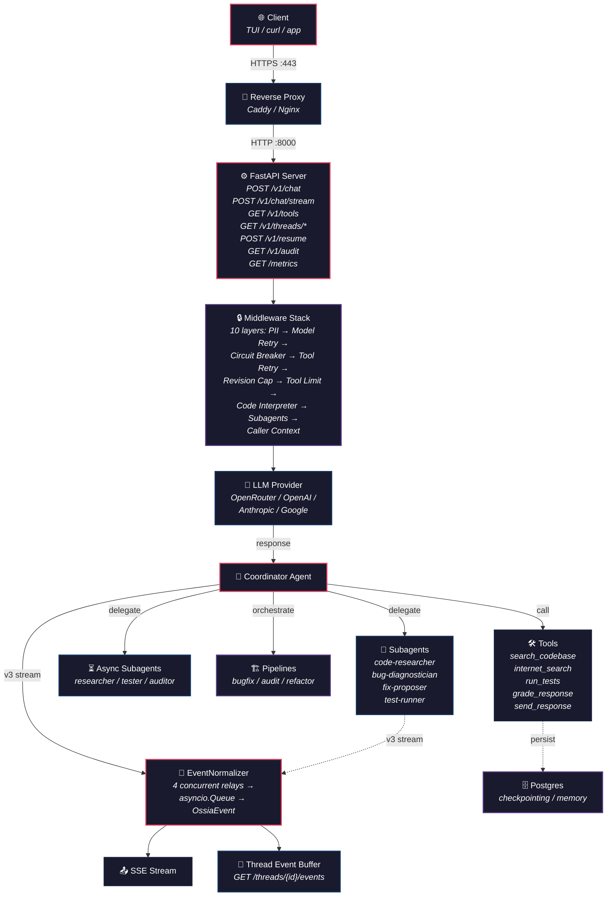

# Ossia — Portable AI Support Agent

<p align="center">
  <a href="https://github.com/Kiy-K/Ossia/actions/workflows/tui-test.yml">
    
  </a>
  
  
  
</p>

**Ossia** is a portable, model-agnostic AI support agent built on [LangChain Deep Agents](https://docs.langchain.com/oss/python/deepagents/overview). It bridges the gap between a raw LLM and a production-ready assistant — providing structured subagent delegation, human-in-the-loop approval, multimodal understanding, programmatic pipelines, and a real-time streaming event protocol.

Think of Ossia as a **digital teammate**: it can research your codebase, diagnose bugs, propose fixes, run tests, audit architecture, and execute multi-step workflows — all through a single unified HTTP API.

## Why Ossia?

| Problem | Ossia's approach |
|---|---|
| Agent frameworks are tied to one provider | **Model-agnostic** — OpenRouter, OpenAI, Anthropic, Google, Nebius, or any OpenAI-compatible endpoint |
| Streaming feels like a black box | **Normalized event protocol** — every message, tool call, subagent spawn, and pipeline step is a typed, ordered, replayable event |
| Subagents are hard to observe | **Concurrent real-time normalization** — coordinator and subagent events stream together in a single ordered feed |
| Hard to debug agent runs | **Thread replay buffer** — `GET /v1/threads/{id}/events` replays the full event stream for any thread |
| Hand-written integration glue | **Spec-driven OpenAPI contract** — `specs/openapi.checked.json` is the pinned source of truth; `test_openapi_drift.py` catches drift |
| One-off scripts instead of API | **Unified `/v1/*` HTTP API** — scripts, notebooks, and TUI all talk to the same FastAPI server |

## Architecture



> 📊 **Architecture diagrams** — See [`docs/diagrams.md`](docs/diagrams.md) for detailed visualizations of every subsystem, including the middleware stack, subagent routing, request flow, event pipeline, and deployment topology.

### Subsystems at a glance

Ossia's architecture is composed of six interconnected subsystems, each documented in its own Architecture Decision Record (ADR) with detailed Mermaid diagrams:

| Subsystem | ADR | What it does | Key diagram |
|-----------|-----|-------------|-------------|
| **API Gateway** | [ADR-0014](docs/adr/0014-standalone-deployment.md) | FastAPI server, auth (Argon2), rate limiting, `/v1/*` routes | [Deployment topology](docs/diagrams.md#5-deployment-topology) |
| **Middleware Stack** | [ADR-0013](docs/adr/0013-production-readiness-middleware-stack.md) | 10-layer defense-in-depth: PII → model retry/fallback → circuit breaker → tool retry → caps → runtime | [Stack order](docs/diagrams.md#2-middleware-stack) + [Request flow](docs/diagrams.md#3-request-flow-sequence) |
| **Agent Runtime** | [ADR-0008](docs/adr/0008-subagent-design-and-routing.md) | Coordinator delegates to subagents with scoped tool permissions | [Subagent routing](docs/diagrams.md#1-subagent-routing) |
| **Event Streaming** | [ADR-0006](docs/adr/0006-streaming-v3-protocol.md) | v3 stream → normalizer (5 concurrent relays) → typed events → SSE | [Event pipeline](docs/diagrams.md#4-event-stream-pipeline) |
| **Memory & Persistence** | [ADR-0007](docs/adr/0007-agent-scoped-memory-and-episodic-recall.md) | Postgres + in-memory store, per-caller namespaces, thread replay buffer | [Deployment topology](docs/diagrams.md#5-deployment-topology) |
| **Orchestrator Pipelines** | [ADR-0008](docs/adr/0008-subagent-design-and-routing.md) | bugfix/audit/refactor pipelines via code interpreter with multi-step workflows | [Subagent routing](docs/diagrams.md#1-subagent-routing) |

### Request lifecycle

A typical request flows through the stack as follows:

1. **Client** sends a request to `POST /v1/chat` via the reverse proxy (Caddy on port 443)
2. **FastAPI** authenticates via `X-API-Key` (Argon2 caller-id derivation), sets rate limits, injects `request_id` and `caller` context
3. **Middleware stack** processes the request through 10 layers — PII redaction strips secrets, model retry/fallback handles provider failures, circuit breaker blocks dead services, tool retry adds backoff, revision cap and tool-call limit prevent runaway agents
4. **Deep Agent runtime** invokes the coordinator, which may delegate to subagents or call tools
5. **EventNormalizer** converts the v3 stream into typed events in real-time via 5 concurrent relays
6. **Response** flows back through the middleware stack in reverse, serialized as SSE events or a JSON response
7. **Cleanup** clears context vars, emits Prometheus metrics, stores events in the thread buffer for replay

## Quick Start

### Using the Makefile (recommended)

```bash
# 1. Create .env from template
make env

# 2. Edit .env with your API keys
#    vim .env   (set OSSIA_API_KEY and OPENROUTER_API_KEY)

# 3. Install dependencies
make install

# 4. Start the dev server
make dev

# 5. Test it
curl -X POST http://localhost:8000/v1/chat \
  -H "X-API-Key: dev" \
  -H "Content-Type: application/json" \
  -d '{"message": "Hello!"}'
```

### Using Docker

```bash
# 0. First, create .env (if you haven't already)
make env
# Edit .env with your API keys (OSSIA_API_KEY, OPENROUTER_API_KEY)

# 1. Build and start the full stack (ossia + postgres + caddy)
make docker-up

# 2. Verify it works
curl http://localhost/health                    # → {"status":"ok"}
curl http://localhost/metrics                   # → Prometheus metrics

# 3. Chat through the proxy
curl -X POST http://localhost/v1/chat \
  -H "X-API-Key: dev" \
  -H "Content-Type: application/json" \
  -d '{"message": "Hello!"}'

# 4. Stream
curl -X POST http://localhost/v1/chat/stream \
  -H "X-API-Key: dev" \
  -H "Content-Type: application/json" \
  -d '{"message": "Explain the architecture"}'
```

### Raw (no Docker)

```bash
# Install dependencies
uv pip install -e ".[dev,notebook]"

# Start the server
OSSIA_API_KEY=dev .venv/bin/python -m uvicorn core.api:app --host 127.0.0.1 --port 8000

# Chat
curl -X POST http://localhost:8000/v1/chat \
  -H "X-API-Key: dev" \
  -H "Content-Type: application/json" \
  -d '{"message": "What files are in the project?"}'
```

## Makefile

The project includes a `Makefile` with 40+ targets organized by category. Run `make help` to see all available commands.

| Category | Key targets |
|----------|-------------|
| **Setup** | `make install`, `make env` — install deps, create `.env` |
| **Development** | `make dev`, `make lint`, `make typecheck`, `make check` |
| **Testing** | `make test`, `make test-focused path=...`, `make test-coverage` |
| **Docker** | `make docker-up`, `make docker-down`, `make docker-logs`, `make docker-ps` |
| **Monitoring** | `make monitor-up`, `make monitor-down`, `make monitor-logs`, `make metrics` |
| **Quality** | `make audit`, `make eval`, `make openapi-drift` |
| **Spec** | `make spec-docs`, `make spec-coverage`, `make changelog` |
| **TUI** | `make tui`, `make tui-install` |
| **Cleanup** | `make clean`, `make clean-all` |

## Docker Compose Stack

The `docker-compose.yml` orchestrates multiple services:

| Service | Role | Depends on |
|---------|------|-----------|
| `ossia` | The agent server (FastAPI) | postgres |
| `postgres` | State persistence, HITL checkpointing | — |
| `caddy` | Reverse proxy (auto HTTPS, security headers) | ossia |
| `prometheus` | Metrics collection (15s scrape interval) | ossia |
| `loki` | Log aggregation and storage | — |
| `grafana` | Dashboards (pre-loaded with Prometheus + Loki datasources) | prometheus, loki |

### Profiles

- **Default** (`docker compose up -d`): starts ossia + postgres + caddy
- **Monitoring** (`docker compose --profile monitoring up -d`): adds prometheus + loki + grafana

### Reverse Proxy

Ossia runs behind Caddy by default, which provides:
- Automatic Let's Encrypt HTTPS (when `DOMAIN` is set)
- Security headers (HSTS, XSS protection, etc.)
- Structured JSON access logs
- Traffic routing from port 80/443 to the internal ossia:8000

An Nginx config is also provided as an alternative (see `nginx.conf`).

## Monitoring Stack

Start with:
```bash
make monitor-up
```

| Component | Access | Purpose |
|-----------|--------|---------|
| **Prometheus** | `http://localhost:9090` | Scrapes `/metrics` from ossia every 15s. 30d retention. |
| **Loki** | `http://localhost:3100` | Aggregates Docker container logs |
| **Grafana** | `http://localhost:3000` (admin/ossia) | 11-panel pre-loaded dashboard |

The Grafana dashboard includes:
- Request rate and HTTP status code distribution
- Latency percentiles (p50, p95, p99)
- Error rate tracking
- Log explorer (Loki query interface)
- CPU and memory usage
- Service uptime

## Key Capabilities

### Model-Agnostic Runtime
Plug in any provider via a single env var: `OpenRouter`, `OpenAI`, `Anthropic`, `Google Gemini`, or any OpenAI-compatible endpoint. The agent framework, tools, subagents, and pipeline logic are entirely provider-independent.

### Real-Time Event Streaming
The EventNormalizer converts the raw DeepAgent v3 stream into a typed, ordered event protocol — coordinator messages, subagent lifecycle, tool calls, pipeline steps, async tasks, and multimodal artifacts all stream in a single ordered feed via SSE.

### Thread Replay Buffer
Every streamed run's normalized events are stored in an in-memory buffer. Clients can late-join or replay via `GET /v1/threads/{id}/events` — useful for TUI session recovery, debugging, and audit.

### Subagent Delegation
7 synchronous subagents (`code-researcher`, `bug-diagnostician`, `fix-proposer`, `test-runner`, `ui-debugger`, `diagram-analyzer`, `visual-regression-reviewer`) and 3 async subagents (`researcher`, `tester`, `auditor`) handle specialized work without filling the coordinator's context.

### Programmatic Pipelines
Three orchestrator pipelines (`run_bugfix_pipeline`, `run_audit_pipeline`, `run_refactor_pipeline`) automate multi-step workflows via the code interpreter — diagnose → propose → test, or research → report, or research → plan → rewrite → validate.

### Multimodal Understanding
Accepts images, documents, audio, and video via `ChatRequest.artifacts`. Specialized subagents (`ui-debugger`, `diagram-analyzer`, `visual-regression-reviewer`) analyze visual content.

### HITL Approval
Human-in-the-loop interrupts on sensitive actions (`send_response`). Reviewers can approve, edit, reject, or respond via `POST /v1/threads/{id}/resume`.

### Spec-Driven Contract
The OpenAPI spec at `specs/openapi.checked.json` is the pinned source of truth. `pytest -k openapi_drift` catches any drift between the code and the contract. Breaking changes bump the URL prefix.

### Security Hardening
All code scanning alerts are resolved (0 open). Caller authentication uses
**Argon2id** for key hashing (memory-hard, GPU-resistant). The eval endpoint
uses a hardcoded dataset path to prevent path traversal. Web search fallback
uses the modern `ddgs` package. See `specs/changelog.md` for details.

## Configuration

All settings are driven by environment variables parsed through Pydantic in `src/core/config.py`.

| Variable | Description | Default |
|---|---|---|
| `OSSIA_API_KEY` | API key for authenticating requests | — |
| `PROVIDER` | Model provider | `openrouter` |
| `MODEL` | Model identifier | `openai/gpt-4o-mini` |
| `OPENROUTER_API_KEY` | OpenRouter key | — |
| `OPENAI_API_KEY` | OpenAI key | — |
| `ANTHROPIC_API_KEY` | Anthropic key | — |
| `GOOGLE_API_KEY` | Google Gemini key | — |
| `POSTGRES_URL` | Postgres DSN for checkpointing | — |
| `ENABLE_HUMAN_REVIEW` | Pause before sending | `true` |
| `MAX_REVISION_LOOPS` | Revision cap | `3` |
| `TAVILY_API_KEY` | Web search (falls back to DuckDuckGo) | — |
| `GRAFANA_USER` | Grafana admin username | `admin` |
| `GRAFANA_PASSWORD` | Grafana admin password | `ossia` |
| `PROMETHEUS_RETENTION` | Prometheus data retention period | `30d` |
| `LOG_DRIVER` | Docker log driver | `json-file` |

## Project Structure

```
src/
  core/              # Core library: agent, api, tools, events, memory,
                     # middleware, config, schemas, graphs, orchestrators
  tui/               # Terminal UI (bun + OpenTUI/React)
tests/               # 100+ tests across all modules
scripts/             # Audit, eval, OpenAPI spec generation, coverage matrix
specs/               # OpenAPI contract, changelog, feature specs, coverage
monitoring/          # Prometheus, Loki, Grafana configs
docs/
  adr/               # Architecture Decision Records (0001..0014)
  agents/            # Agent context reference
  skills/            # Loadable skill files (web-search, code-review)
  diagrams.md        # 📊 Index of all architecture diagrams
```

## Deploy

Ossia ships as a single FastAPI app. Deploy anywhere you can run a Docker container or a `uvicorn` process:

```bash
# Using the Makefile (recommended)
make docker-build
make docker-up

# Manual Docker
docker build -t ossia .
docker run -p 8000:8000 -e OSSIA_API_KEY=... -e OPENROUTER_API_KEY=... ossia

# With full stack (postgres + caddy)
docker compose up -d --build

# With monitoring stack
docker compose --profile monitoring up -d

# Raw process
.venv/bin/python -m uvicorn core.api:app --host 0.0.0.0 --port 8000
```

## License

MIT
