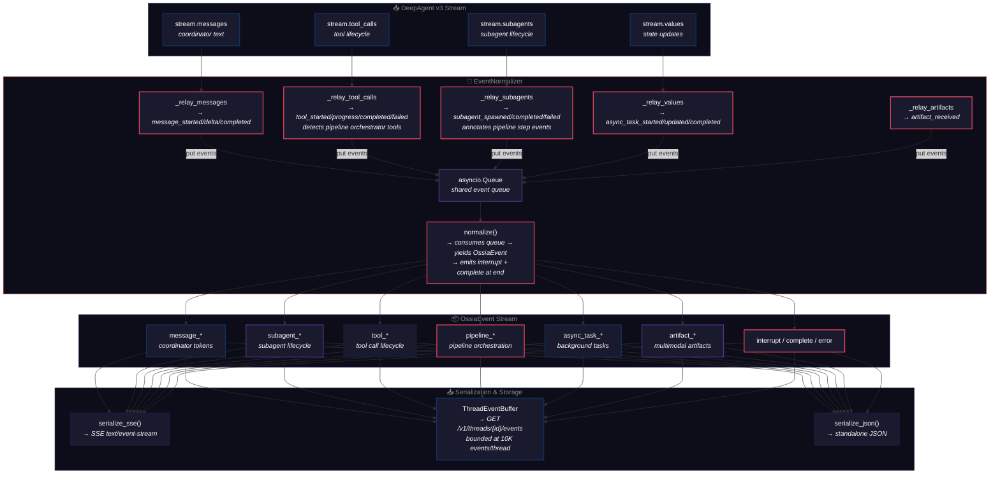

# ADR-0006: Streaming switches to the langgraph v3 protocol

**Status:** accepted.
**Date:** 2026-06-22.
**Supersedes:** ADR-0004 §4, which used `astream_events(version="v2")` for the streaming endpoint.

## Context

The first cut of `POST /v1/chat/stream` (ADR-0004) used the v2 protocol: `agent.astream_events(input, config, version="v2")` returns a flat async stream of `{event, name, data}` dicts that clients narrow by `event` (e.g. `on_chat_model_stream`, `on_tool_start`, `on_tool_end`).

langgraph 1.x ships a v3 protocol (`astream_events(..., version="v3")`) that returns a typed projection object with `.messages`, `.values`, `.subagents`, `.tool_calls`, `.output`, `.interrupted`, `.interrupts`. The consumer drives the run by iterating typed projections rather than receiving a stream of opaque events.

The v3 protocol is marked experimental upstream (`@beta(message="The v3 streaming protocol on Pregel is experimental.")`) but is the only protocol that supports typed subagent streaming, the caller-driven `output`/`interrupted`/`interrupts` surface, and the content-block-centric streaming model that the rest of langgraph is converging on. The v2 path remains supported in langgraph 1.x but is no longer the recommended surface.

## Decision

`POST /v1/chat/stream` is rebuilt on `astream_events(input, config, version="v3")`. The wire format becomes a discriminated-union SSE envelope: each event's SSE `event:` field is one of seven `kind` values (`message`, `tool_call`, `subagent`, `value`, `interrupt`, `complete`, `protocol`) and the `data:` payload is a per-kind typed object. A final `kind="complete"` event is always sent; `data.interrupted=true` means the run paused on a human-review interrupt and the client should call `POST /v1/threads/{id}/resume`.

The URL prefix stays `/v1/...` because the route shape and auth are unchanged; only the streaming wire format changes. Per the v1.1.0 entry in `specs/changelog.md`, this is documented as a breaking change to `POST /v1/chat/stream` only — other v1 routes are unaffected.

We do **not** keep a v2 alias. Per house style, breaking changes do not get a deprecated twin. Clients on the v2 wire shape must migrate to v3; the migration is a one-liner (loop over `kind` instead of `event`).

## Consequences

- **Pro:** typed projections are stable across langgraph versions; the wire contract is the part we promise to clients, the projection adapters in `api.py:chat_stream` are the part we adapt.
- **Pro:** subagent streams are first-class — clients can render a "researcher" card alongside the coordinator's stream without re-implementing the v3 mux.
- **Pro:** pause/resume is part of the wire contract (`kind="complete"` with `interrupted=true`); clients no longer need to detect interrupts out-of-band.
- **Con:** v3 is experimental. If upstream changes a projection's attribute names (e.g. `tool_name` → `name`), we have to update the adapters and clients don't have to change. If upstream removes v3 entirely, the wire contract survives and the adapters need a rewrite.
- **Con:** the v2 audit harness internal call (`scripts/audit_ossia.py` uses `astream_events(version="v2")` to enumerate tool events) is fine but no longer mirrors the public streaming path. Documented in AGENTS.md.

## Alternatives considered

1. **Keep v2 and add a new `/v2/chat/stream` for v3.** Splits the surface into "old" and "new" and requires clients to pick. The v2 path is the wrong default now that v3 is the recommended upstream. Rejected; the v1 endpoint *is* the breaking change.
2. **Wait for v3 to drop the @beta marker.** v3 has been experimental for several langgraph releases and is unlikely to stabilize on a near-term horizon. Waiting for stability would leave the API on the deprecated v2 path indefinitely. Rejected; the wire-contract / adapter split makes the bet affordable.
3. **Wrap v3 in a per-event v2-emulation layer.** Translates v3 events back to v2 dicts for the wire. Strictly worse than using the typed projections directly. Rejected.
